# SSH Brute-Force Detection Lab

A SOC-style detection lab simulating an SSH brute-force attack against a Linux target and detecting the activity in Splunk SIEM. The project covers the full attack chain — reconnaissance, password attack, log evidence collection, SIEM integration, and detection engineering — from the perspectives of both attacker and defender.

---

## Overview

| | |
|---|---|
| **Attack scenario** | SSH brute-force against weak password using Hydra |
| **Target** | Ubuntu Server 26.04 with OpenSSH 10.2p1 |
| **Attacker** | Kali Linux 2024 |
| **SIEM** | Splunk Enterprise 10.2.2 |
| **Outcome** | Successful compromise detected via correlation logic |

The simulated attack succeeded in **6 seconds** and was reliably detected through four progressively refined SPL queries, culminating in a real-time alert and a monitoring dashboard.

---

## Lab Architecture

The lab consists of three components on an isolated VirtualBox Host-only network:

```
┌────────────────────────┐         ┌────────────────────────┐
│   Kali Linux 2024      │         │  Ubuntu Server 26.04   │
│   192.168.56.102       │ ──SSH──▶│   192.168.56.101       │
│   (Attacker)           │  brute  │   OpenSSH 10.2p1       │
│                        │  force  │   user: jakov          │
└────────────────────────┘         └────────────────────────┘
                  │                            │
                  │                            │
                  └─────────┬──────────────────┘
                            │
                            ▼
                ┌────────────────────────┐
                │  Windows Host          │
                │  192.168.56.1          │
                │  Splunk Enterprise     │
                │  (SIEM)                │
                └────────────────────────┘
```

| Component | IP | Role |
|---|---|---|
| Kali Linux 2024 | 192.168.56.102 | Attacker — runs Nmap and Hydra |
| Ubuntu Server 26.04 | 192.168.56.101 | Target — OpenSSH server, weak password |
| Windows host | 192.168.56.1 | SIEM — Splunk Enterprise indexes auth logs |

The network is fully isolated. No traffic leaves the host machine.

---

## Attack Execution

### Reconnaissance — Nmap

A basic port scan identifies the SSH service:

```bash
$ nmap 192.168.56.101

Nmap scan report for 192.168.56.101
Host is up (0.00068s latency).
PORT   STATE SERVICE
22/tcp open  ssh
```

Service detection confirms the SSH version:

```bash
$ sudo nmap -sV -O -p 22 192.168.56.101

PORT   STATE SERVICE VERSION
22/tcp open  ssh     OpenSSH 10.2p1 Ubuntu 2ubuntu3 (Ubuntu Linux; protocol 2.0)
```

### Password List

A small wordlist of common weak passwords was prepared on the attacker:

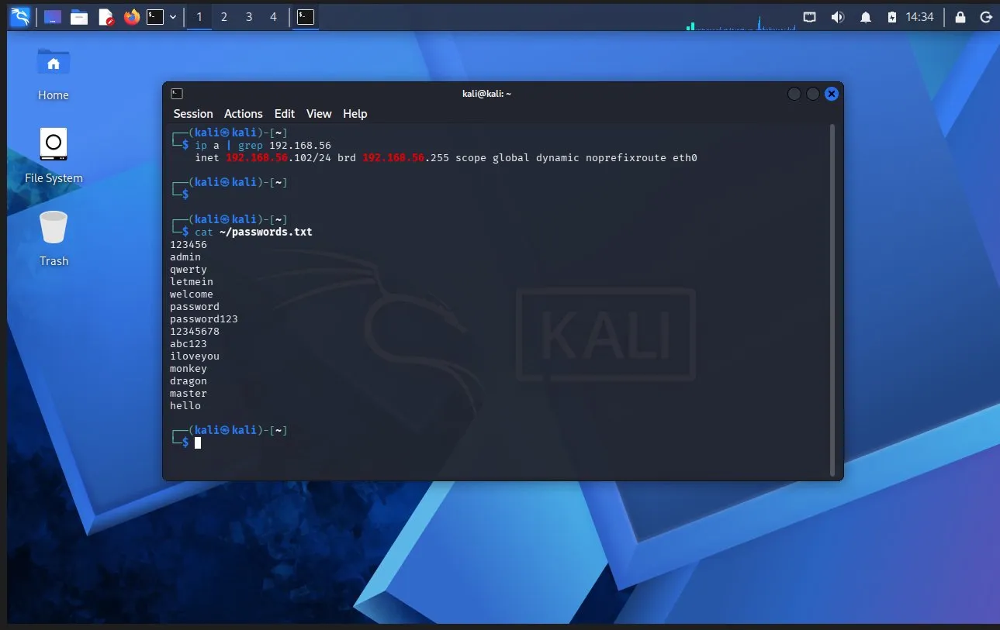

The list contains 14 entries including `password123` at position 7.

### Brute-force — Hydra

Hydra is invoked against SSH with the prepared wordlist:

```bash
hydra -l jakov -P ~/passwords.txt -t 4 -V ssh://192.168.56.101
```

The attack succeeds on the 7th attempt, in approximately 6 seconds:

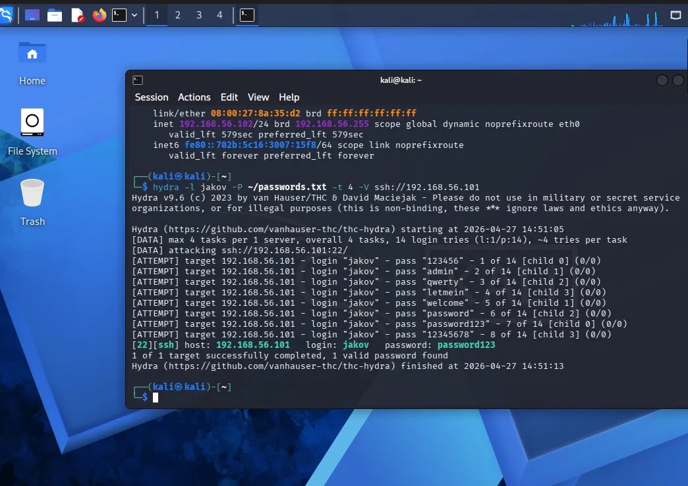

```
[22][ssh] host: 192.168.56.101   login: jakov   password: password123
1 of 1 target successfully completed, 1 valid password found
```

---

## Log Evidence

The Ubuntu authentication log (`/var/log/auth.log`) recorded the attack as a tight burst of failures followed by a successful login:

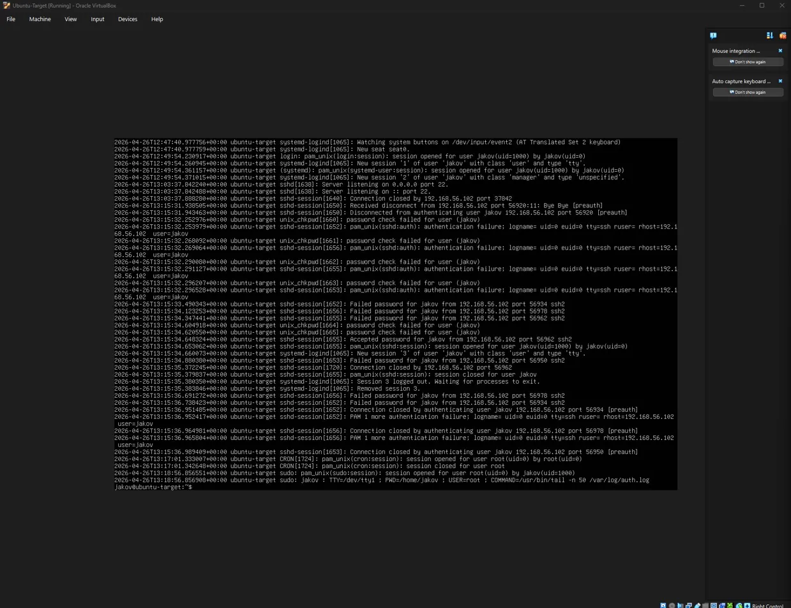

Key observations:

- **6 `Failed password` events** for user `jakov` from `192.168.56.102`
- **1 `Accepted password` event** mid-burst (the moment the password was guessed)
- All events span approximately **3 seconds** (15:15:33–15:15:36)
- Multiple ephemeral source ports (56934, 56950, 56962, 56978...) — Hydra opened parallel TCP sessions

The raw log is included in [`/logs/auth_log_demo.log`](logs/auth_log_demo.log) for reproducibility.

---

## SIEM Integration — Splunk

The auth log was transferred from the Ubuntu target to the Windows host via SCP and ingested into Splunk:

```powershell
PS C:\splunk-lab> scp jakov@192.168.56.101:/home/jakov/auth_log_demo.log .
```

In Splunk, the file was uploaded with the appropriate source type for Linux authentication events:

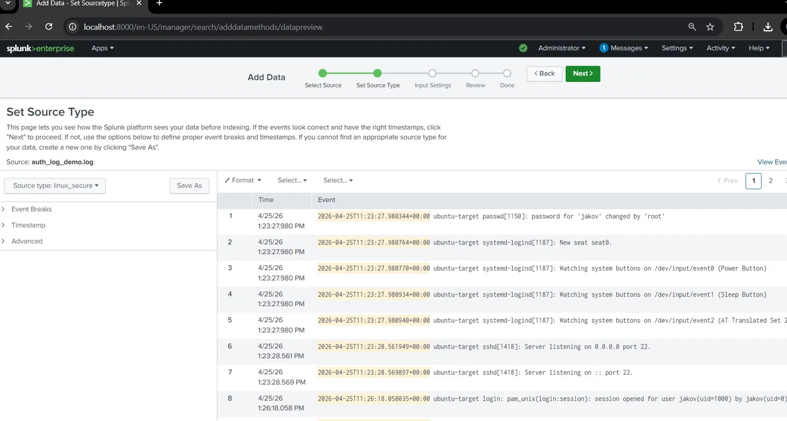

| Setting | Value |
|---|---|
| Source type | `linux_secure` |
| Host | `ubuntu-target` |
| Index | `bruteforce_lab` |

A total of **67 events** were indexed, covering the full session including the attack burst:

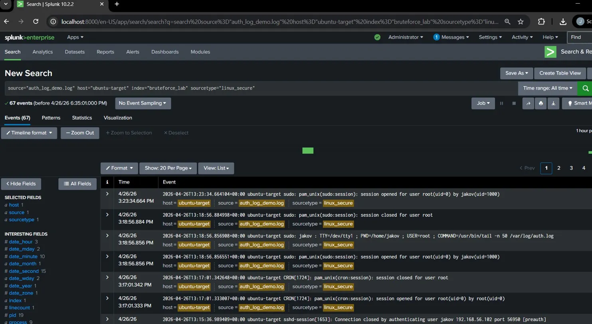

---

## Detection Logic

Four SPL queries were developed to progressively refine the detection — from raw event isolation to correlation logic that identifies a successful compromise. All queries are available in [`/splunk-queries/detection_queries.spl`](splunk-queries/detection_queries.spl).

### 1. Failed Login Attempts

A baseline query isolating SSH authentication failures:

```spl
index=bruteforce_lab sourcetype=linux_secure "Failed password"
```

Returns **6 events**, all from `192.168.56.102` targeting user `jakov`:

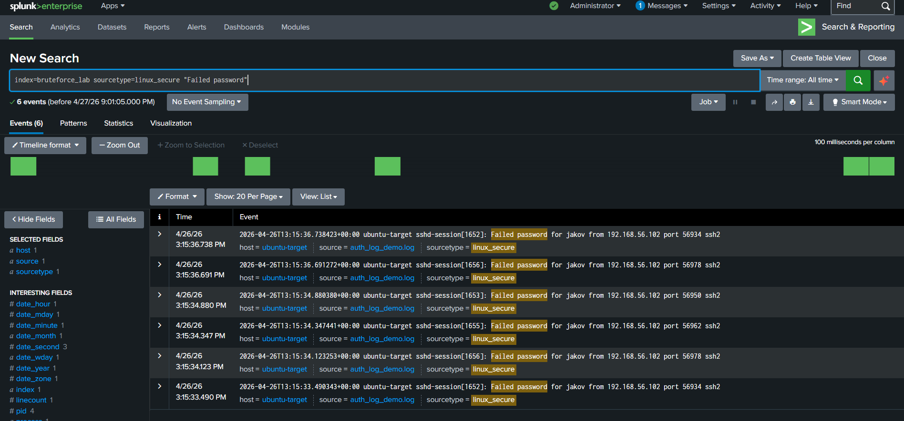

### 2. Stats Aggregation

Aggregation by source IP and target user provides an executive summary view. A regex extraction (`rex`) is required because Splunk does not parse these fields automatically from the raw `linux_secure` events:

```spl
index=bruteforce_lab sourcetype=linux_secure "Failed password"
| rex "Failed password for (?<user>\w+) from (?<src_ip>[\d\.]+)"
| stats count by src_ip, user
```

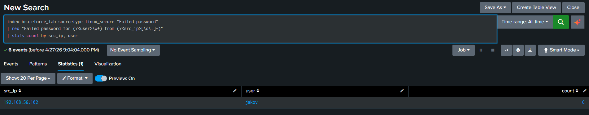

| src_ip | user | count |
|---|---|---|
| 192.168.56.102 | jakov | 6 |

### 3. Threshold Detection

Counting alone is not enough — six failed attempts spread over a year is normal user behavior, but six failures within seconds is an attack. A time-window threshold distinguishes the two:

```spl
index=bruteforce_lab sourcetype=linux_secure "Failed password"
| rex "Failed password for (?<user>\w+) from (?<src_ip>[\d\.]+)"
| bin _time span=1m
| stats count by _time, src_ip, user
| where count >= 5
```

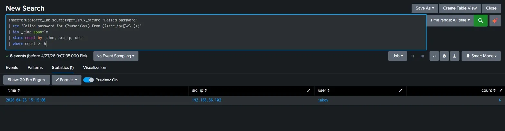

The query buckets events into 1-minute windows and only returns IP/user pairs with 5 or more failed attempts — the classical brute-force fingerprint.

### 4. Failed → Accepted Correlation

The most operationally relevant query. A pattern of many failed attempts **followed by a successful login** from the same source IP indicates a successful compromise — a high-severity incident requiring immediate response:

```spl
index=bruteforce_lab sourcetype=linux_secure (("Failed password") OR ("Accepted password"))
| rex "(?<auth_result>Failed|Accepted) password for (?<user>\w+) from (?<src_ip>[\d\.]+)"
| stats count(eval(auth_result="Failed")) as failed_attempts, 
        count(eval(auth_result="Accepted")) as successful_logins 
        by src_ip, user
| where failed_attempts >= 5 AND successful_logins >= 1
```

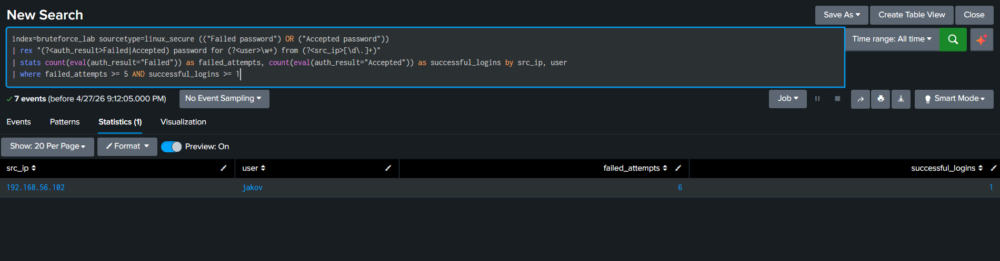

| src_ip | user | failed_attempts | successful_logins |
|---|---|---|---|
| 192.168.56.102 | jakov | 6 | 1 |

This single row constitutes a confirmed compromise event. In a SOC workflow, this would trigger an immediate response: account lockdown, password reset, audit of all activity originating from the source IP, and a check for lateral movement.

---

## Real-Time Alert

The correlation query was saved as a real-time alert in Splunk:

| Setting | Value |
|---|---|
| Alert name | SSH Brute-Force Successful Compromise |
| Type | Real-time |
| Trigger | Per-Result |
| Action | Add to Triggered Alerts |

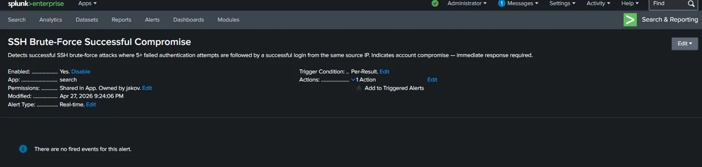

In a production environment, the same alert would be paired with a Splunk Universal Forwarder streaming `auth.log` from monitored hosts, and would route to email, ticketing, or SOAR playbooks instead of the in-app Triggered Alerts list.

---

## Dashboard

A four-panel dashboard provides a single-pane overview of the brute-force activity:

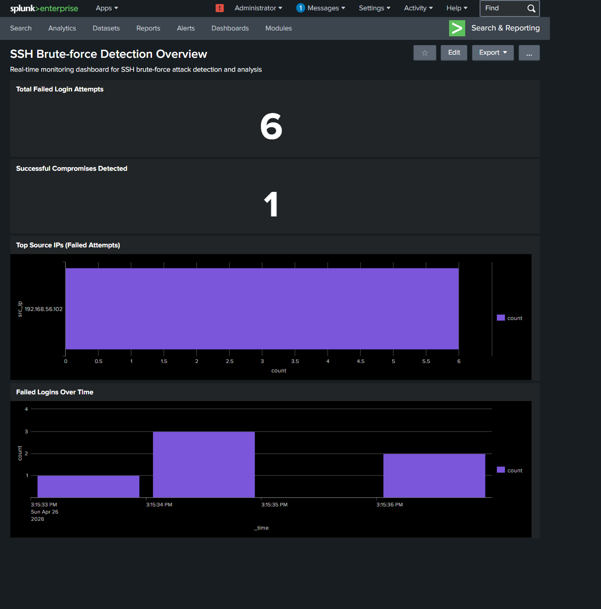

| Panel | Type | Insight |
|---|---|---|
| Total Failed Login Attempts | Single Value | Volume of authentication failures |
| Successful Compromises Detected | Single Value | Count of confirmed compromise events |
| Top Source IPs (Failed Attempts) | Bar Chart | Identifies the most active attackers |
| Failed Logins Over Time | Column Chart | Reveals burst patterns on the timeline |

The timeline panel is particularly diagnostic — six failures concentrated in three seconds is a visual signature of an automated tool, not a forgetful user.

---

## Mitigations

In a real environment, the following controls would have prevented or significantly slowed this attack:

- **Strong password policy or key-based authentication.** Disabling password authentication (`PasswordAuthentication no` in `sshd_config`) eliminates the attack vector entirely.
- **fail2ban or sshguard.** Automatic IP banning after a configurable number of failed attempts neutralizes brute-force attempts at the host level.
- **Multi-factor authentication.** A second factor renders a guessed password insufficient on its own.
- **Network segmentation.** SSH should not be exposed directly to untrusted networks; a bastion host or VPN should mediate access.

---

## Repository Structure

```
SSH-Bruteforce-Detection-Lab/
├── README.md
├── LICENSE
├── /screenshots          Evidence and Splunk UI captures
├── /logs                 Raw auth.log from the attack
└── /splunk-queries       SPL detection queries
```

---

## Author

**Jakov Zoričić**  
GitHub: [@jzoricic1](https://github.com/jzoricic1)

---

*This is a controlled lab environment built for educational purposes. All activity took place on isolated virtual machines on the author's hardware. No real systems were targeted.*
